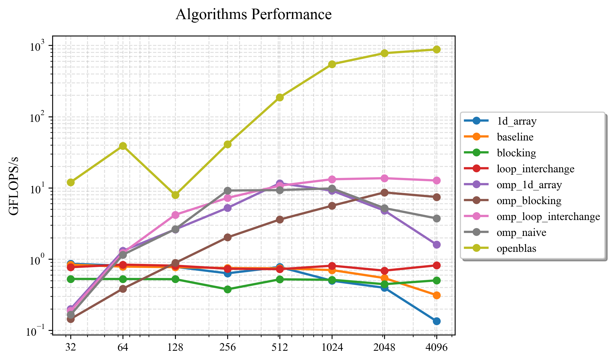

# 矩阵乘法性能优化实验报告

<div style="text-align:center">
    王艺杭<br>
    2023202316
</div>

## 实验目的
本次实验旨在深入研究和实践矩阵乘法（GEMM）的性能优化技术。

## 实验环境
CPU: 13th Gen Intel(R) Core(TM) i9-13900HX (8 P-cores + 16 E-cores, 32 Threads, P-core Max Turbo @ 5.40 GHz)
指令集: AVX2
缓存: L1 2.1 MB, L2 32.0 MB, L3 36.0 MB
操作系统: Windows 11 (via PowerShell)
编译器: g++ (MinGW-w64)
并行库: OpenMP
>> 理论峰值 GFLOPS/s = P-core 频率 (GHz) × P-core 数量 × 每周期单精度浮点运算次数
>> $ \text{理论峰值} = 5.40 GHz × 8 cores × 32 = 1382.4 GFLOPS/s $
## 实验原理与方法
本次实验实现并评估了以下几种算法：
Baseline: 标准的三重 i-j-k 循环，作为性能基准。
1D-Array: 将二维矩阵用一维数组存储，优化内存布局，提高数据连续性。
Loop Interchange: 交换循环顺序，改善数据访问的局部性，提高缓存命中率。
Blocking (Tiling): 将大矩阵划分为能装入缓存的小块进行计算，最大化数据重用。
OpenMP Parallelization: 对上述算法应用 OpenMP (#pragma omp parallel for)，利用多核 CPU 并行计算。
## 实验结果与分析
所有算法在不同矩阵规模（N）下的性能（GFLOPS/s）如下图所示：



结果分析:

在串行算法中，loop_interchange 和 1d_array 等优化措施相比 baseline 提升微弱。当矩阵规模 N 增大时，由于无法利用多核优势，性能均出现瓶颈或下降。引入 OpenMP 后，性能获得了数量级的提升。在我们的手动实现中，omp_loop_interchange 表现最佳，在 N=2048 时达到了 13.68 GFLOPS/s。这证明了简单的循环结构非常契合现代编译器的自动向量化（AVX2）能力。
omp_blocking 算法的性能未达到理论预期，甚至不如简单的 omp_loop_interchange。这揭示了手动分块的复杂性：不合适的块大小和复杂的循环结构可能会干扰编译器的优化，导致性能不升反降。OpenBLAS 展示了压倒性的性能，在 N=8192 时达到了 1078.9 GFLOPS/s，成功发挥了 CPU 理论峰值（1382.4 GFLOPS/s）的 78%。这得益于其手写汇编、极致的 SIMD 指令应用和精细的缓存管理策略。

## 运行

``` powershell
./run.bat N ITERATIONS
```


```